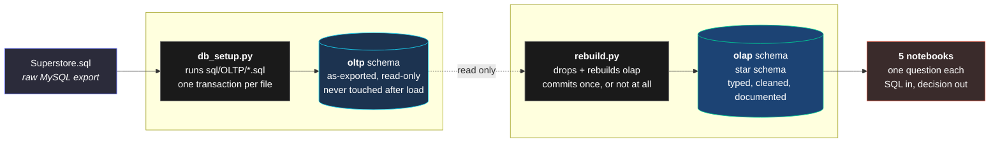
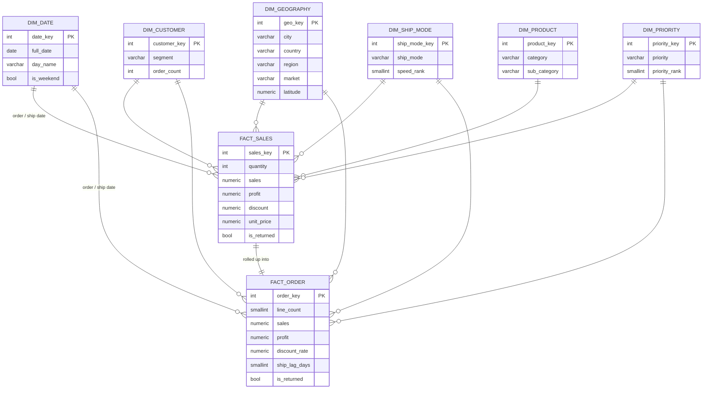
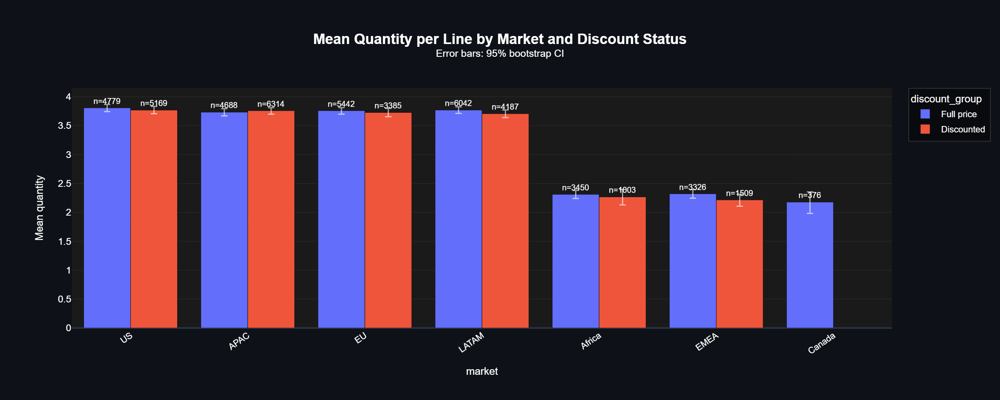
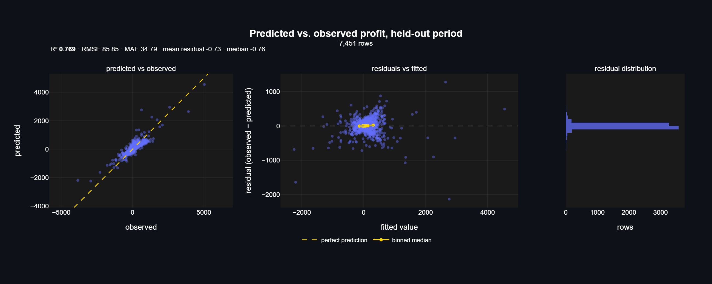
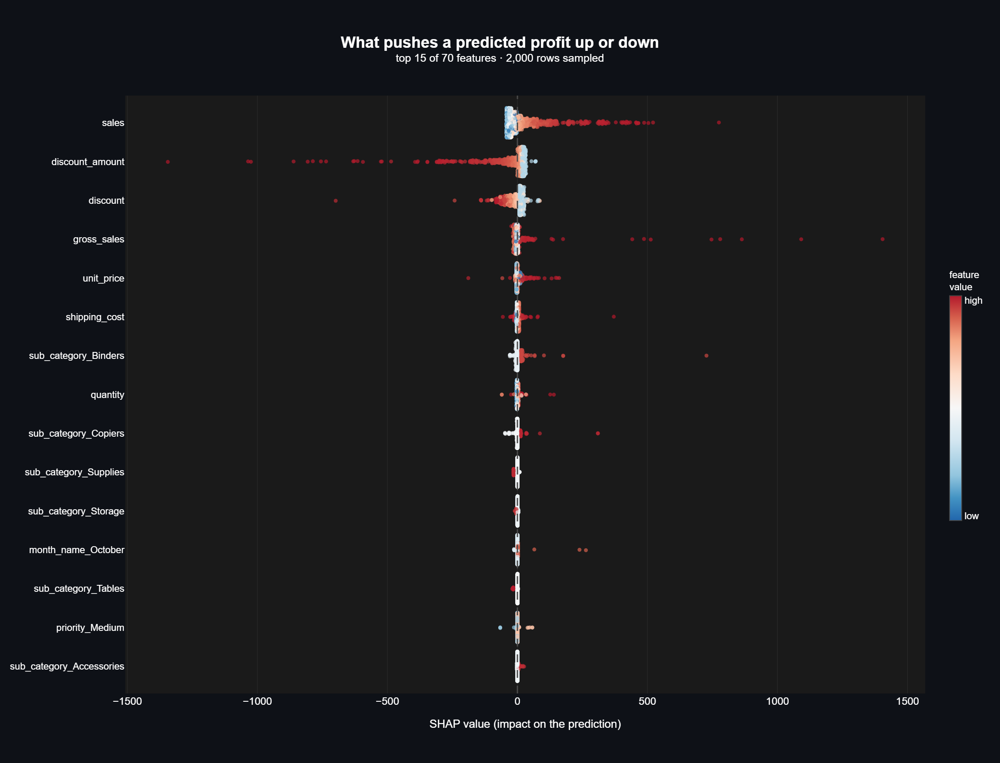
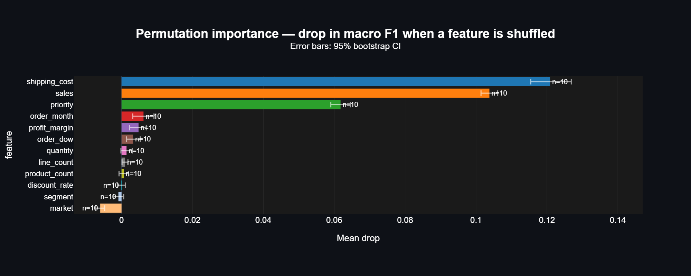
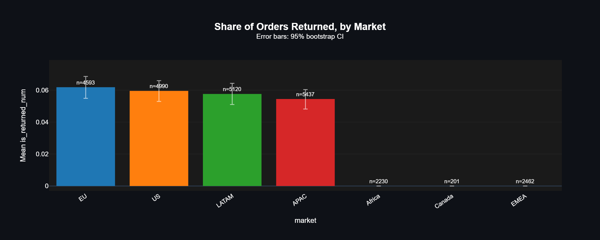
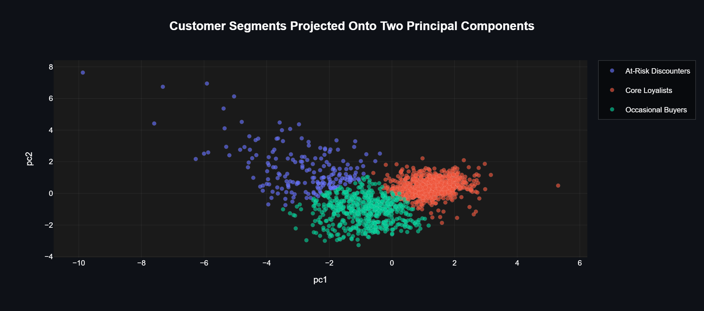

# Superstore

A four-year retail dataset rebuilt into a Postgres warehouse and worked through
five analyses, each ending in a decision someone could act on rather than a
number someone could quote.

<p>


</p>

**25,033 orders · 49,670 order lines · 1,589 customers · 7 markets ·
2011-01-01 to 2014-12-31**

> Originally a team project for the Quera data analysis bootcamp, rebuilt
> since by [@arianmokhtariha](https://github.com/arianmokhtariha) on a real
> warehouse with the modelling redone from scratch. Original team:
> [@AlirezaNyi](https://github.com/AlirezaNyi) ·
> [@arianmokhtariha](https://github.com/arianmokhtariha) ·
> [@mohsen20roohi-hue](https://github.com/mohsen20roohi-hue) ·
> [@MonaKheirieh](https://github.com/MonaKheirieh) ·
> [@anooshanth](https://github.com/anooshanth)

---

## Four decisions this analysis supports

**Stop discounting past 20%.** Discounts do not move volume. Discounted lines
sell 0.17 more units on average, a 5% lift that sounds real until you see the
effect size (Cliff's δ = 0.06, "negligible") and watch it reverse inside five
of the six markets that discount. Past 20% off, quantity actually *falls*: from
3.74 units at a light discount down to 2.96 at 61%+, where the median order
drops to 2 units. The store is buying nothing with the deepest cuts.

**Flag loss-making lines before they ship.** A quarter of order lines lose
money. A profit model trained on everything up to September 2014, then tested
on the four months after it, catches **80.3%** of them at **90.3%** precision,
covering **$122,531 of the $133,809** lost in that window, from information a
checkout screen already has.

**Fix the returns extract before trusting any returns report.** Three of the
seven markets record zero returns across four full years and 4,893 orders. Not
a low rate. Zero. Every returns-by-geography chart in this business is
currently wrong.

**Split the customer base three ways, and cap the discount on one of them.**
52% of customers generate 90.8% of profit. A separate 12% generate **−5.2%** —
they are a net loss, they take a 31% median discount, and they are not loyal
in return (121 days since last order).

---

## Architecture

The database is the single source of truth. Nothing reads a CSV.



Every transformation from `oltp` to `olap` is pure SQL, held in numbered files
so the whole warehouse is reproducible from the raw export in two commands.
`rebuild.py` refuses to target `oltp`, so the base layer can only ever be read.

### The star schema

Two facts at different grains over one conformed set of dimensions. Getting the
grain right is a correctness question here, not a style preference — see
[Keeping the numbers honest](#keeping-the-numbers-honest).



Three decisions in the model worth naming. Market lives inside
`dim_geography` rather than as its own dimension, because `(country, region)`
determines it with zero violations and adding it costs no rows. `dim_date` is
generated and gap-free across whole calendar years rather than harvested from
dates that happened to appear. And the 35 repeated `(order, product)` pairs are
kept as separate lines, because their measures differ and collapsing them would
delete revenue.

---

## The analyses

### 1. Do discounts actually sell more units?

The store's folklore says cut the price and volume more than makes up for it.
Only the first half of that is testable here, so that is what gets tested:
does a discount change the quantity on a line?

Pooled across 49,670 lines the answer looks like yes. Discounted lines average
3.57 units against 3.40, and Mann-Whitney returns p = 1.2 × 10⁻³⁰. But at that
sample size almost any difference clears significance, so the number that
decides it is the effect size: **Cliff's δ = 0.06**, negligible, with both
groups sharing a median of 3 units.

Then it falls apart entirely under stratification.



Inside every market the two bars sit on top of each other, and Canada shows one
bar because it has never run a discount at all. None of the six discounting
markets is significant after Holm correction, and **five of the six point the
opposite way** from the pooled result. The aggregate lift is a mix
effect: the markets that discount most (APAC, US) happen to be the markets that
already move the most units, while Africa, EMEA and Canada discount least and
buy in smaller quantities. Pooling manufactures a correlation that does not
exist within any market.

Discount depth does not rescue it either. Mean quantity peaks at a *light*
discount and falls from there:

| discount band | mean quantity | median | lines |
| :--- | ---: | ---: | ---: |
| none | 3.40 | 3 | 28,103 |
| 1–20% | **3.74** | 3 | 10,555 |
| 21–40% | 3.68 | 3 | 4,301 |
| 41–60% | 3.36 | 3 | 4,637 |
| 61%+ | **2.96** | **2** | 2,074 |

Among discounted lines, the rank correlation between discount rate and quantity
is **−0.14**. Deeper cuts are associated with *fewer* units, not more.

**Decision:** cap discounting at 20%. Everything beyond it gives away margin
for volume that does not arrive.

> [`hypothesis_testing/discount_effect_on_quantity.ipynb`](hypothesis_testing/discount_effect_on_quantity.ipynb)

---

### 2. Which order lines lose money, and can we see it coming?

A quarter of order lines lose money. If that were visible at checkout, the line
could be re-priced, re-routed or declined instead of written off later.

An XGBoost regressor trained on 2011 through August 2014 and tested on the
final four months reaches **R² 0.769**, against 0.716 for a regularised linear
model and 0.000 for predicting the mean. Average error is **$34.79** against
the baseline's $67.93.



The interesting part is not the score, it is what the model leans on:



`sales` pushes profit up, and `discount_amount` pushes it down about as hard —
individual lines pulled below −$1,400 by the discount alone. Sub-category adds
a second layer: Tables, Supplies and Storage lines carry a penalty the discount
does not explain, while Binders, Copiers and Accessories carry a premium. The
warehouse backs that up. Tables is the only sub-category in the catalogue with
a **negative** aggregate margin, −8.9% against a store-wide +11.6%.

Run as a checkout-time flag on the test period:

| | flagged | not flagged |
| :--- | ---: | ---: |
| **actually lost money** | 1,464 (80.3%) | 359 (19.7%) |
| **actually made money** | 158 (2.8%) | 5,470 (97.2%) |

**Decision:** flag predicted-negative lines at checkout. It catches 80.3% of
loss-makers at 90.3% precision and covers 91.6% of the period's dollar loss.
The 359 it misses are the small ones — median −$15 against −$22 for those it
catches.

> [`ml/profit_regression/profit_regression.ipynb`](ml/profit_regression/profit_regression.ipynb)

---

### 3. Which shipping tier will an order use?

Premium shipping is a revenue line. If an order heading for Standard Class
could be spotted at checkout, the store could discount Second Class and nudge
the customer up a paid tier.

CatBoost reaches **macro F1 0.397** against 0.187 for always guessing Standard
and 0.250 for guessing at the right class odds. Roughly twice the trivial
answer, no overfitting worth the name — and still not enough to run a campaign
on.



Three features carry the entire model, and everything else is at or below
0.006. Two of the three measure how big and expensive the shipment is; the
third is an urgency flag someone ticks at order entry. Nothing in the warehouse
records *why* a customer chose a tier, what delivery dates and prices they were
shown, or whether they happened to be in a hurry. The model can see the shape
of the parcel and how urgent it was marked, and from that it recovers a rough
version of a rule the business already applies.

The metric that kills the business case is per-class: recall on Second Class,
the tier the whole upsell depends on, is **0.204**. Four in five go
unrecognised.

**Decision:** do not launch the nudge program on this model. Run a
priced A/B test on the Standard-bound population instead and learn the
uplift directly. The model's useful output is the sizing, not the targeting.

> [`ml/ship_mode/ship_mode_classification.ipynb`](ml/ship_mode/ship_mode_classification.ipynb)

---

### 4. Which orders come back?

This one ends in a negative result, and the negative result is the deliverable.

Returns cannot be predicted usefully from this data. The best model reaches
**0.132** average precision against a 0.047 base rate, and a plain logistic
regression matches a tuned gradient-boosted tree — the bootstrap interval on
the difference straddles zero. When extra model capacity buys nothing, there is
usually nothing left to find.

The finding that matters is *why*:



Four markets sit in a tight 5.4–6.2% band, exactly what one process running
everywhere looks like. Three record **zero returns** across four full years.
EMEA alone has 2,462 orders; the probability of seeing no returns there at the
store-wide rate is about 10⁻⁵². This is not customer behaviour, it is a gap in
how returns were collected, and `market_region` is the strongest feature the
model has.

The source table is a bare list of order IDs. No dates, no reason codes.

**Decision:** do not build a returns model. Fix the extract, then capture
per-product and per-customer return history and reason codes. Until then, treat
every returns-by-geography report as wrong.

> [`ml/return_risk/return_risk_classification.ipynb`](ml/return_risk/return_risk_classification.ipynb)

---

### 5. Which customers behave differently enough to treat differently?

K-means over six per-customer features — recency, frequency, average order
value, average discount rate, profit margin and basket size. The original
analysis clustered on raw *sums*, which mostly measure tenure; averages measure
behaviour.

k = 3, chosen over the elbow's k = 4 because k = 3 reproduces perfectly across
random seeds (adjusted Rand index 1.000 across all 45 pairs) while k = 4
drifts. Silhouette is **0.346** — moderate, and reported as such. These are
useful conventions, not natural kinds.



| segment | customers | share of profit | recency | orders | avg order | discount | margin |
| :--- | ---: | ---: | ---: | ---: | ---: | ---: | ---: |
| **Core Loyalists** | 831 (52%) | **90.8%** | 21 d | 25 | $505 | 14% | 13% |
| **Occasional Buyers** | 571 (36%) | 14.3% | 95 d | 6 | $286 | 12% | **17%** |
| **At-Risk Discounters** | 187 (12%) | **−5.2%** | 121 d | 5 | $154 | **31%** | **−31%** |

Occasional Buyers turn the best margin per order of the three. At-Risk
Discounters take the deepest discounts, return the worst margin, and are the
least recent — the discount is not buying loyalty back.

**Decision:** three lists with three discount authorities. Protect the
Loyalists (losing them costs 90.8% of profit). Grow frequency on the Occasional
Buyers, whose margin is already the best in the book. Cap the discount on the
At-Risk group; it costs little, because the depth is buying nothing.

> [`ml/customer_segments/customer_segmentation.ipynb`](ml/customer_segments/customer_segmentation.ipynb)

---

## The thread running through all of it

Three analyses reach the same conclusion from three different grains with three
different methods:

| analysis | grain | method | result |
| :--- | :--- | :--- | :--- |
| Discount effect | order line | Mann-Whitney, stratified | δ = 0.06, reverses within market |
| Profit regression | order line | XGBoost + SHAP | `discount_amount` is the top driver of losses |
| Customer segments | customer | K-means | deepest-discounted segment is the only unprofitable one |

At customer level the correlation between discount rate and profit margin is
**−0.55**; between discount rate and order frequency it is **−0.08**.

Discounting at this store costs margin without buying volume or loyalty. Any
one of these on its own would be suggestive. Three, at different grains, is a
finding.

---

## Keeping the numbers honest

The bootcamp version of this project reported ~85% accuracy on ship mode and a
working returns classifier. Both evaporated under scrutiny. What changed:

**Grain.** `fact_sales` is order-line grain, `fact_order` is order grain.
Ship mode and returns are properties of an *order*; training them at line grain
repeats one order's label across all its lines and puts the same order on both
sides of the train/test split. Moving to order grain cut the sample from 49,670
to 25,033 and the scores with it.

**Leakage, audited feature by feature.** `cost` and `profit_margin` are
algebraically derived from profit (`cost = sales − profit`), so neither can
predict it. `dim_customer`'s lifetime aggregates are computed over a customer's
whole history, so a 2011 order joins to a `last_order_date` from 2013 — the
future leaking backward. `dim_ship_mode`'s averages span 2011–2014, leaking the
test period into training through the dimension table.

**One case that went the other way.** `shipping_cost` looked like leakage and
is not: ship mode explains only **3.1%** of its variance, while order value
explains most of it (r = 0.79). But `shipping_cost_pct` — the same cost divided
by order value — *is* leakage, because dividing out the size leaves the tier
premium behind (**31%** of its variance). One column is a size proxy, the other
is the target wearing a different name. Only measuring them separately shows
which is which.

**Model selection off the test set.** The original used the test set as
CatBoost's early-stopping `eval_set` with `use_best_model=True`, which lets the
test score choose the iteration. Three-way split instead.

**Baselines everywhere.** Every model is reported against a trivial one. Two
of them barely beat it, and that is stated rather than buried.

---

## Repository

```
sql/
  OLTP/          raw export split into numbered files, schema-qualified
  OLAP/          star schema: dimensions, facts, and assertions that abort a bad build
db_setup.py      builds oltp from sql/OLTP
rebuild.py       drops and rebuilds olap from sql/OLAP; refuses to target oltp
utils/
  db_utils.py    run_query -> DataFrame
  custom_plots.py   23 plotly figures: EDA + model diagnostics, one house style
  custom_stats.py   18 functions: tests that return tidy frames carrying effect
                    sizes and CIs, plus the effect-size measures themselves
hypothesis_testing/
  discount_effect_on_quantity.ipynb
ml/
  profit_regression/    predict line profit          XGBoost
  ship_mode/            predict shipping tier        CatBoost
  return_risk/          predict order returns        LightGBM
  customer_segments/    segment customers            K-means
assets/          figures exported from the executed notebooks
```

Every notebook is self-contained: it queries `olap` with inline SQL, charts
through `custom_plots`, tests through `custom_stats`, and runs top to bottom
with no external module to read first. There are no feature-engineering
scripts, no pickled models and no CSVs.

`custom_plots` is a single house style across every figure in the project —
dark theme, WCAG-checked colour ramps, confidence intervals on every aggregate.
No function duplicates another's job: a confusion matrix is `cross_tab_heatmap`
with a forced square, and feature importance is `grouped_bar_plot` over
permutation repeats, which yields a real interval rather than a bare bar.

---

## Reproducing

```bash
# 1. Postgres credentials
cp .env.example .env        # DB_USER, DB_PASSWORD, DB_HOST, DB_PORT, DB_NAME

# 2. Build the warehouse from the raw export
python db_setup.py          # loads sql/OLTP  -> oltp schema
python rebuild.py           # builds sql/OLAP -> olap schema, seconds

# 3. Run the analyses
jupyter lab
```

Requires Python 3.13, PostgreSQL 16, and `pandas numpy scikit-learn xgboost
lightgbm catboost shap scipy statsmodels plotly sqlalchemy psycopg2-binary
python-dotenv`.

`rebuild.py` is designed to be run over and over: it drops the target schema,
replays every SQL file in order, and commits once at the end, so a failure
anywhere leaves the previous schema intact. Iterating on the model means
editing a `.sql` file and re-running, never reloading the source data.
